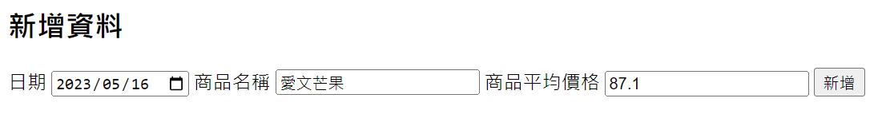

# Web程式設計 HW4 通貨膨脹-你關心缺蛋嗎?

# 商品資料

商品名稱：愛文芒果

商品的資料來源：[http://114.35.252.67/pagepub/AppContent.aspx?GP=GP04.01](http://114.35.252.67/pagepub/AppContent.aspx?GP=GP04.01)

商品特色：產期約在5～7月、果實紅色，外表色澤鮮豔，皮薄肉細，幾無纖維，味香多汁

# 執行流程

作品網址：[https://poetry15.github.io/HW4_1.github.io/](https://poetry15.github.io/HW4_1.github.io/)

## 新增資料

### **用表單接收資料**



```html
<h2>新增資料</h2>
<form id="mango" action="http://localhost:3000/api" method="post">
    <label for="date">日期</label>
    <input type="date" id="date" name="date">
    <label for="name">商品名稱</label>
    <input type="text" id="name" name="name">
    <label for="price">商品平均價格</label>
    <input type="text" id="price" name="price">
    <button type="submit">新增</button>
</form>
```

### **post資料到資料庫中**


```jsx
router.post('/', (req, res) => {
    const {date, name, price}=req.body;
    sql = "INSERT INTO mango (日期, 商品名稱, 商品平均價格) VALUES (?, ?, ?)";
    db.run(sql, [ date, name, price], (err) => {
        if (err) {
            console.error(err.message);
            return res.status(500).send(err.message);
        }
    });
    res.redirect('/index.html');
 })
```

## 顯示資料

### 可以選擇資料的顯示範圍


- 程式碼
    
    ```jsx
    async handleClick() {
    	console.log("data");
    	const url = "http://localhost:3000/api"; // 資料傳送到的 URL
    	try {
    		const response = await fetch(url, {
    			method: 'GET',
    		});
    		const res_data = await response.json();
    		if (this.selectedEnd && this.selectedStart) {
    			this.data = res_data.filter(item => item.日期 >= this.selectedStart && item.日期 <= this.selectedEnd);
    		}
    		else if (this.selectedEnd && !this.selectedStart) {
    			this.data = res_data.filter(item.日期 <= this.selectedEnd);
    		}
    		else if (!this.selectedEnd && this.selectedStart) {
    			this.data = res_data.filter(item => item.日期 >= this.selectedStart);
    		}
    		else {
    			this.data = res_data;
    		}
    		console.log("成功", res_data );
    	} catch (error) {
        console.log("錯誤", error);
    	}
    }
    ```
    
- **有四種情況的判斷**
    1. 可以都不輸入範圍，會顯示資料庫內所有的資料
        - 程式碼
            
            ```jsx
            async handleClick() {
            	console.log("data");
            	const url = "http://localhost:3000/api"; // 資料傳送到的 URL
            	try {
                const response = await fetch(url, {
            	    method: 'GET',
                });
                const res_data = await response.json();
            		else { //都不輸入範圍
            			this.data = res_data;
            		}
            		console.log("成功", res_data );
            	} 
            	catch (error) {
            		console.log("錯誤", error);
            	}
            }
            ```
            
    2. 只輸入初始日期，會顯示該日期**以後(含當天)**的資料
        
        
        
        - 程式碼
            
            ```jsx
            async handleClick() {
            	console.log("data");
            	const url = "http://localhost:3000/api"; // 資料傳送到的 URL
            	try {
                const response = await fetch(url, {
                    method: 'GET',
                });
                const res_data = await response.json();
            		else if (this.selectedStart && !this.selectedEnd) {
            	    this.data = res_data.filter(item => item.日期 >= this.selectedStart);
                }
            		console.log("成功", res_data );
            	} 
            	catch (error) {
            		console.log("錯誤", error);
            	}
            }
            ```
            
    3. 只輸入結束日期，會顯示該日期**以前(含當天)**的資料
        
        
        
        - 程式碼
            
            ```jsx
            async handleClick() {
            	console.log("data");
            	const url = "http://localhost:3000/api"; // 資料傳送到的 URL
            	try {
                const response = await fetch(url, {
                    method: 'GET',
                });
                const res_data = await response.json();
            		else if (!this.selectedStart && this.selectedEnd) {
            	    this.data = res_data.filter(item => item.日期 <= this.selectedEnd);
                }
            		console.log("成功", res_data );
            	} 
            	catch (error) {
            		console.log("錯誤", error);
            	}
            }
            ```
            
    4. 輸入初始日期與結束日期，會顯示**兩個日期範圍內(含初始與結束的日期)**的資料
        
        
        
        - 程式碼
            
            ```jsx
            async handleClick() {
            	console.log("data");
            	const url = "http://localhost:3000/api"; // 資料傳送到的 URL
            	try {
                const response = await fetch(url, {
                    method: 'GET',
                });
                const res_data = await response.json();
            		if (this.selectedEnd && this.selectedStart) {
            	    this.data = res_data.filter(item => item.日期 >= this.selectedStart && item.日期 <= this.selectedEnd);
                }
            		console.log("成功", res_data );
            	} 
            	catch (error) {
            		console.log("錯誤", error);
            	}
            }
            ```
            

### 確保輸入範圍正確

- **有三種正確的輸入**
    - 初始日期不可早於2022-04-27
        
        
        
    - 如果只輸入一個日期或都不輸入視為有效輸入
        
        
        
        
        
        
        
    - 如果輸入兩個日期，需確保初始日期比結束日期還早，否則為無效輸入
        
        
        
- 程式碼
    
    ```jsx
    <button v-on:click="handleClick" :disabled="!isDateValid(selectedStart, selectedEnd)">顯示資料</button>
    
    <script>
    	isDateValid(startDate, endDate) {
    		if (startDate && endDate) {
    			// 如果起始日期和結束日期都有輸入，則確認起始日期不晚於結束日期
    			return startDate <= endDate;
    		}
    		if (startDate) { // 初始日期最早為2022-04-27
    			const limitDate = new Date('2022-04-27');
    			const selectedDate = new Date(startDate);
    			return selectedDate >= limitDate;
    		}
    		if (!startDate || !endDate) {
    			// 如果起始日期和結束日期都未輸入，表示查詢全部資料，視為有效
    			return true;
    		}
    		// 其他情況視為無效
    		return false;
    	}
    </script>
    ```
    

### 照日期先後排序顯示

```jsx
this.data.sort((a, b) => new Date(a.日期) - new Date(b.日期)); //將資料依先後順序排列
```

- **輸入資料**
    
    新增一筆2023-02-03的
    
    
    
    目前這筆資料是資料庫的最後一筆
    
    
    
- **點擊顯示資料**
    
    會按照日期的大小排序
    
    
